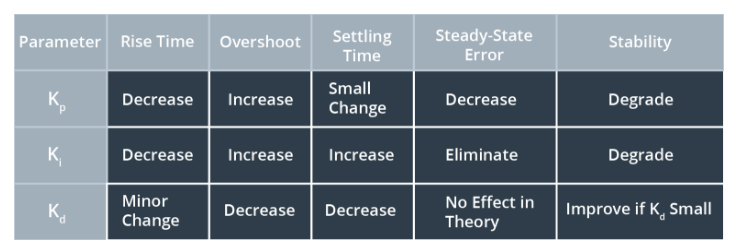

# Lab: Control systems

This project is on control systems. 

### Objectives
Implementing a PID control system on a Quadrotor. The [simulator](
https://github.com/udacity/RoboND-Controls-Lab/releases) used for this project is built on Unity. The Quadrotor starts off at a particular location, and has a destination, which is a Lava platform.

### PID Controller
Proportional, integral and derivative components are used. Each with an effect.

### Video
https://youtu.be/0wCkroJA7J0
